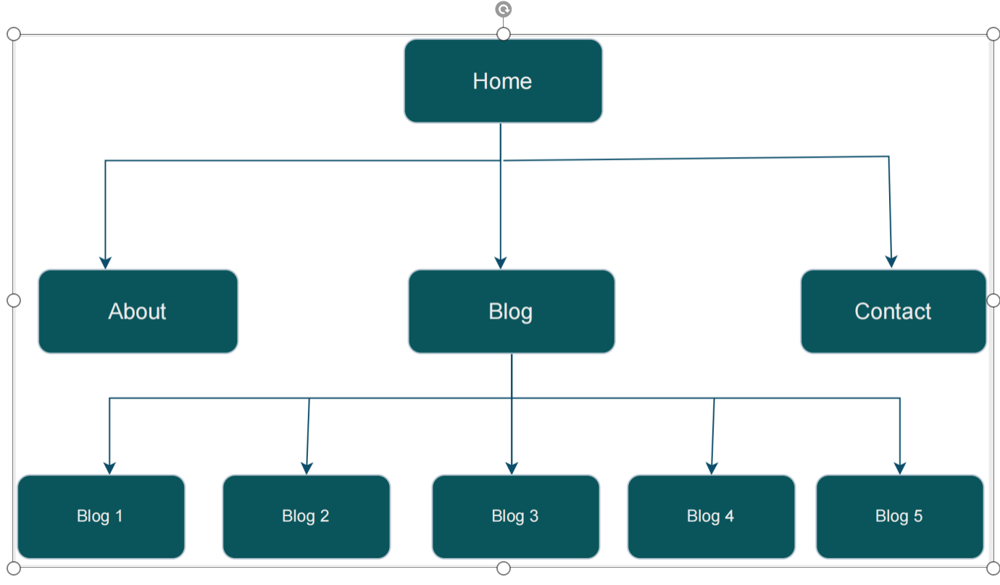
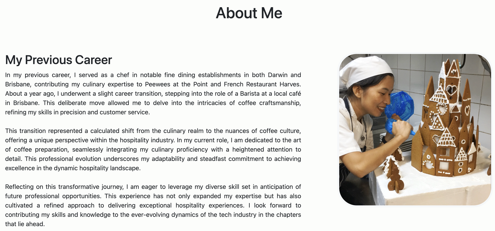
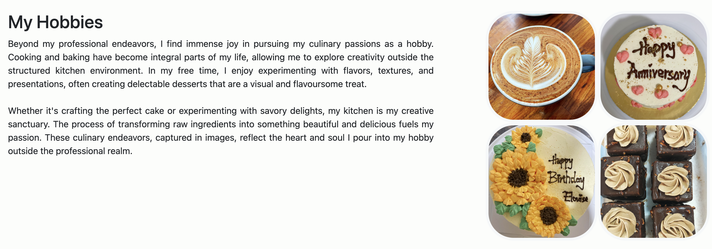
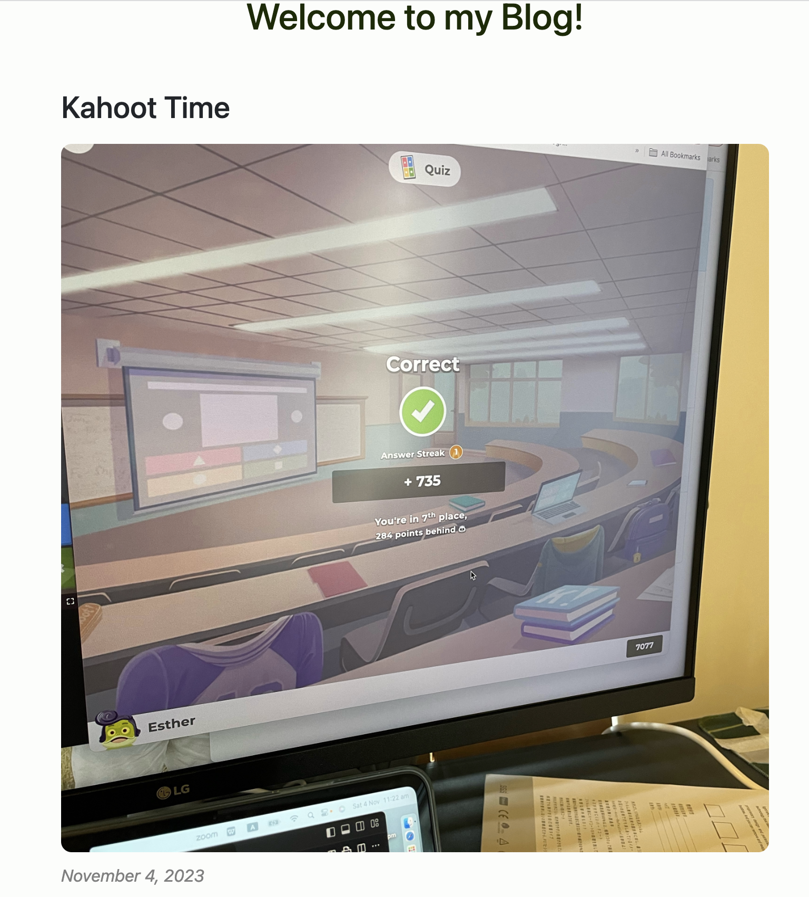
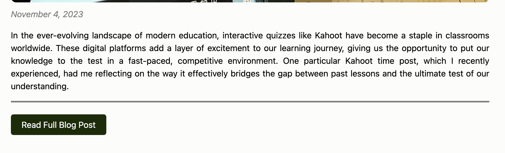
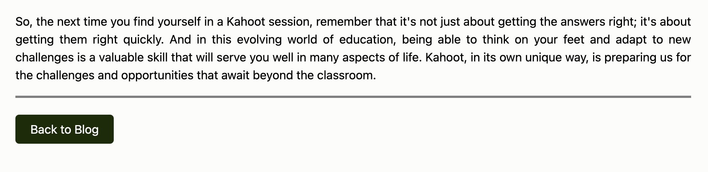
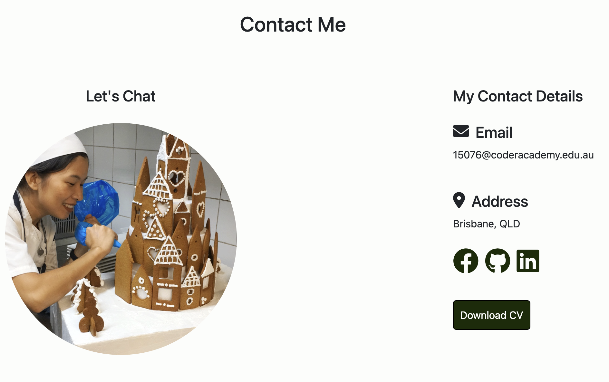
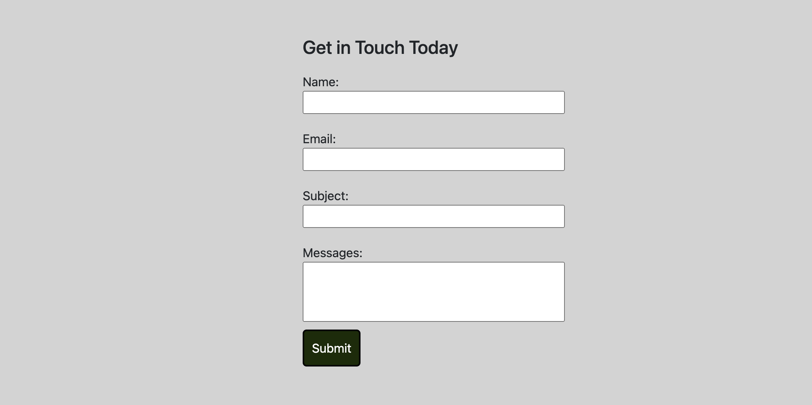

# THIS IS SHUZHEN LIU'S (ESTHER'S) PORTFOLIO


### Portfolio website
[link to portfolio](https://shuzhen-portfolio.netlify.app/)

### Git repo
[link to git](https://github.com/estherszliu/portfolio)

### Presentation
[link to presentation]()

## Purpose
This is a portfolio website to display about Shuzhen's (Esther's) work experience, hobbies, why she wants to become a developer, demonstrate her skills and also her social life, and finally a way get in touch with her. 

This website will be used to showcase my abilities, skills and interests to any potential employers.

## Target Audience

The target audience for this website will be Recruiters, Hiring managers, and Employers who have a high level of knowledge and experience with software development. It is expected that most visitors will know about the technologies and experiences I have listed. 

## Tech Stack

This website was built using the following tech stack.
* HTML
* SCSS/CSS
* Javascript
* Github
* Figma for designs
* Netlify for website deployment

## Overview
The portfolio wedsite has four main pages + five blog post pages nested below the main blog page. The structure looks like this:
* Home
* About
* Blog 
    * Blog 1
    * Blog 2
    * Blog 3
    * Blog 4
    * Blog 5 
* Contact

## Sitmap 
Here is the picture of the sitemap :


## Common Page Components

### Page Header
The page header is the component at the top of the website. It contains pictures, messages, a navigation bar and also a nav-icon.

When you click on the profile image, it will navigate to the About page. All the other buttons navigate to the screen displayed in the text. 


For smaller screens such as mobile and tablets, the navbar changes to a dropdown hamburger menu. The hamburger nav-icon here has a javascript function which is used to show and hide the dropdown nav menu.


Here is the code for the header:
```html
 <header class="header-root">
    <!-- Graphical Component: Profile image with welcome message -->
    <section class="profile-message">
        <a href="./pages/about.html">
            
        </a>
        <label>
            "Hi, I'm Esther!"
        </label>
    </section>
    <!-- Text Component: Responsive navigation menu -->
    <nav>
        <div id="nav-buttons-root" class="nav-buttons-root-hide">
            <a class="nav-button" href="./index.html">Home</a>
            <a class="nav-button" href="./pages/about.html">About</a>
            <a class="nav-button" href="./pages/blog.html">Blog</a>
            <a class="nav-button" href="./pages/contact.html">Contact</a>
        </div>
        <a class="nav-icon" onclick="toggleNavMenu()">
            <i class="fa fa-bars"></i>
        </a>
    </nav>
 </header>
```
Here is the function for the nav-icon which is locate in the head tag and used to change the classname of the component:
```html
<script>
    function toggleNavMenu() {   
        var e = document.getElementById("nav-buttons-root");
        if (e.className === "nav-buttons-root") {
            e.className = "nav-buttons-root-hide";
        } else {
            e.className = "nav-buttons-root";
        }
    }  
 </script>
```

### Footer

The footer has a text message, social media links, and a hypertext reference to send an email. 


Here is the code for footer:
```html
 <footer>
    <!-- Graphical Component: Contact me through social media -->
    <section class="social-media">
        <h5>Get in touch with me today</h5>
        <div class="social-contacts-container">
            <a href="https://www.facebook.com" target="_blank">
                <i class="fa-brands fa-facebook"></i>
            </a>
            <a href="https://www.github.com" target="_blank">
                <i class="fa-brands fa-github"></i>
            </a>
            <a href="https://www.linkedin.com" target="_blank">
                <i class="fa-brands fa-linkedin"></i>
            </a>
        </div>
    </section>

    <!-- Text Component: Send mail button -->
    <section class="footer-contact">
        <a href="mailto: 15076@coderacademy.edu.au">
            Send mail
            <i class="fa-regular fa-paper-plane"></i>              
        </a>
    </section>
</footer>
```

### Home page
In the Home page main tag, there is two sections, the first section is an introduction and a picture, second section is set of lozenges display what skills I have.


Here is a snippet of the code:
```html
<main>
    <section>

        <!-- Graphical Component: Intro bio about me with an image -->
        <section class="bio-root">
            <div>
                <div>
                    <h1>
                        Shuzhen Liu(Esther)
                    </h1> 
                    <h4>
                        Software developer
                    </h4>
                </div>
                <div class="bio-description">
                    <p>
                        Text here
                    </p>
                </div>
            </div>
            <aside>
                
            </aside>  
        </section>

        <!-- Text Component: List of my skills -->
        <section class="skills-root">
            <h5>
                My Skills
            </h5>
            <div class="skills-row-container">
                <div class="skill-lozenge">HTML</div>
                <div class="skill-lozenge">CSS</div>
                <div class="skill-lozenge">Python</div>
                <div class="skill-lozenge">Git</div>
                <div class="skill-lozenge">Web Development</div>
            </div>
            <div class="skills-row-container">
                <div class="skill-lozenge">Flask</div>
                <div class="skill-lozenge">MySQL</div>
                <div class="skill-lozenge">Backend Development</div>
                <div class="skill-lozenge">OOP</div>
                <div class="skill-lozenge">SASS</div>
            </div>
        </section>
    </section>
</main>
```

### About page
The About page has three articles, the first and third one both with a picture as a aside, but the second article has an aside with image grid showing 4 images side by side.



Here is a snippet of the code:
```html
<main>   
    <section>
        <div class="heading">
            <h1>About Me</h1>
        </div>
        <div class="about">

            <!-- Text Component: Article with Header -->
            <article>
                <h2>
                    My Previous Career
                </h2>
                <p>
                    Text here
                </p>
            </article>

            <!-- side image -->
            <aside>
                
            </aside>
        </div>
        <div class="about">

            <!-- Text Component: Article with Header -->
            <article>
                <h2>
                    My Hobbies
                </h2>
                <p>
                    Text here
                </p>
            </article>

                <!--Graphical Component: Side Image Grid-->
            <aside>
                <div class="image-grid-4">
                    <div class="image-grid-row">
                        
                        
                    </div>
                    <div class="image-grid-row">
                        
                        
                    </div>
                </div>
            </aside>
        </div>
        <div class="about">

            <!-- Text Component: Article with Header -->
            <article>
                <h2>
                    Why I Want to be a Developer
                </h2>
                <p>
                    Text here
                </p>
            </article>

                <!-- Side image -->
            <aside>
                
            </aside>
        </div>
    </section>
</main>
```

### Blog page
The Blog page has a title at the top of the page in the middle and is followed by five sections, where each section is one blog summary. Each section contains a figure (title, image, date), an article and a hypertext reference to link to read the full blog post. 


Here is a snippet of the code:
```html
<main>
    <div class="blog-heading">
        <h1>Welcome to my Blog!</h1>
    </div>
        
    <!-- Kahoot Blog Post -->
    <section>
        <!-- Graphical Component: Blog hero image with date and title -->
        <figure>
            <h2>Kahoot Time</h2>
            <div class="image-container">
                
            </div>
            <time>
                November 4, 2023
            </time>
        </figure>

        <!-- Text Component: Blog summary -->
        <article class="content">
            <p>
                Text here
            </p>
        </article>

        <!-- Text Component: Blog navigation -->
        <nav>
            <a href="./blog-posts/blog-1-kahoot.html">
                Read Full Blog Post
            </a>
        </nav>
    </section>

    ... more blogs here

</main>
```

### The Read Full Blog Post
The Read Full Blog Post is the on the Blog page when you want to read the full Blog page, it will direct to a html which contain the single blog contents, which has the same post title, picture, time and article. On the bottom after the article, also has a button of Back to Blog which will direct back to the main blog page. 



Here is a snippet of the code:
```html
<main>
    <div class="blog-heading">
        <h1>Welcome to my Blog!</h1>
    </div>
    <section>

        <!-- Graphical Component: Blog hero image with date and title -->
        <figure>
            <h2>Feeding Kangaroos</h2>
            <div class="image-container">
                
            </div>
            <time>
                September 5, 2023
            </time>
        </figure>

        <!-- Text Component: Blog content -->
        <article class="content">
            Text here
        </article>

        <!-- Text Component: Blog navigation -->
        <nav>
                <a href="../blog.html">
                    Back to Blog
                </a>
        </nav>
    </section>
</main>
```

### Contact Page
The Contact page has two section, the first section has heading, image, contact details, social media links and a bottom to download CV. The seccond section has a contact form which user can input their name, email, subject, messages. 



Here is a snippet of the code:
```html
 <main>
    <div class="contact-heading">
        <h2>Contact Me</h2>
    </div>
    <section class="body-content">
        <section class="contact-me-container">

            <!-- Graphical Component: Image with header -->
            <figure class="image-container">
                <h4>Let's Chat</h4>
                
            </figure>

            <!-- Contact Details -->
            <section class="contact-details-container">
                <h4>My Contact Details</h4>

                <!-- Text Component: Contact Item -->
                <section class="contact-item">
                    <div class="contact-title">
                        <i class="fa-solid fa-envelope"></i>
                        <h4>Email</h4>
                    </div>
                    <p>15076@coderacademy.edu.au</p>
                </section>

                <!-- Text Component: Contact Item -->
                <section class="contact-item">
                    <div class="contact-title">
                        <i class="fa-solid fa-location-dot"></i>
                        <h4>Address</h4>
                    </div>
                    <p>Brisbane, QLD</p>
                </section>

                <!-- Graphical Component: Social Media Links -->
                <section class="social-items">
                    <a href="https://www.facebook.com" target="_blank">
                        <i class="fa-brands fa-facebook"></i>
                    </a>
                    <a href="https://www.github.com" target="_blank">
                        <i class="fa-brands fa-github"></i>
                    </a>
                    <a href="https://www.linkedin.com" target="_blank">
                        <i class="fa-brands fa-linkedin"></i>
                    </a>
                </section>

                <!-- Download CV -->
                <section class="download-tag">
                    <a href="../files/cv.docx" download="cv">Download CV</a>
                </section>
            </section>
        </section>

        <!-- Text Component: Contact Form -->
        <section class="contact-form-container">
            <section class="contact-form">
                <h4>Get in Touch Today</h4>
                <form>
                    <div class="form-input-container">
                        <label>Name:</label>
                        <input class="form-input">
                    </div>
                    <div class="form-input-container">
                        <label>Email:</label>
                        <input class="form-input">
                    </div>
                    <div class="form-input-container">
                        <label>Subject: </label>
                        <input class="form-input">
                    </div>
                    <div class="form-input-container">
                        <label>Messages:  </label>
                        <textarea
                            rows="3"
                            class="form-input"
                            id="form-textarea"
                        ></textarea>
                    </div>
                    <div class="btn-div">
                        <button id="submit">Submit</button>
                    </div>
                </form>
            </section>
        </section>
    </section>
</main>
```
