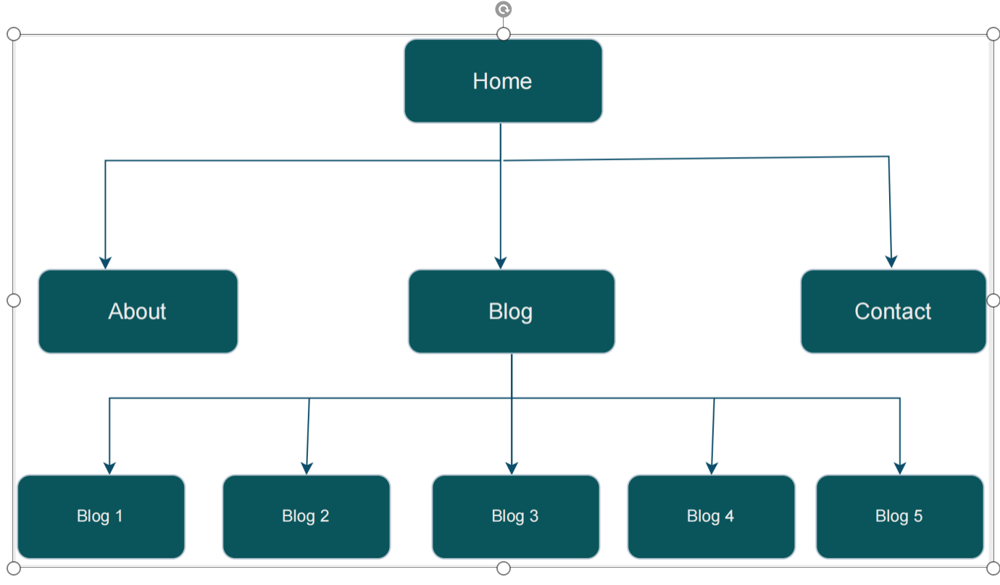

# THIS IS ESTHER DENNIS' PORTFOLIO

### Portfolio website
[link to portfolio](https://shuzhen-portfolio.netlify.app/)

### Git repo
[link to git](https://github.com/estherszliu/portfolio)

### Presentation
[link to original presentation](https://youtu.be/rvz773aSSns)
## Purpose
This is a portfolio website to display about Esther Dennis's work experience, hobbies, why she wants to become a developer, demonstrate her skills and also her social life, and finally a way get in touch with her. 

This website will be used to showcase my abilities, skills and interests to any potential employers.

## Target Audience

The target audience for this website will be Recruiters, Hiring managers, and Employers who have a high level of knowledge and experience with software development. It is expected that most visitors will know about the technologies and experiences I have listed. 

## Tech Stack

This website was built using the following tech stack.
* HTML
* SCSS/CSS
* Javascript
* Github
* Figma for designs
* Netlify for website deployment

## Overview
The portfolio wedsite has four main pages + five blog post pages nested below the main blog page. The structure looks like this:
* Home
* About
* Blog 
    * Blog 1
    * Blog 2
    * Blog 3
    * Blog 4
    * Blog 5 
* Contact

## Sitmap 
Here is the picture of the sitemap :
