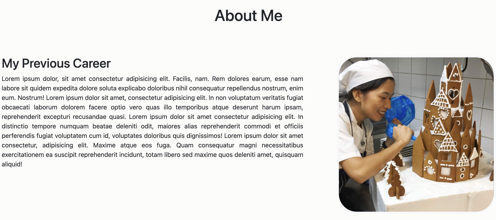
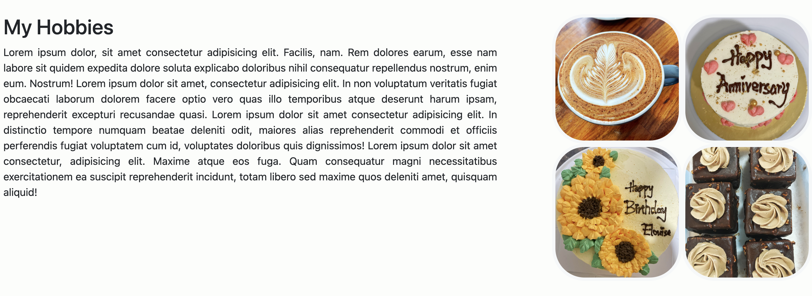
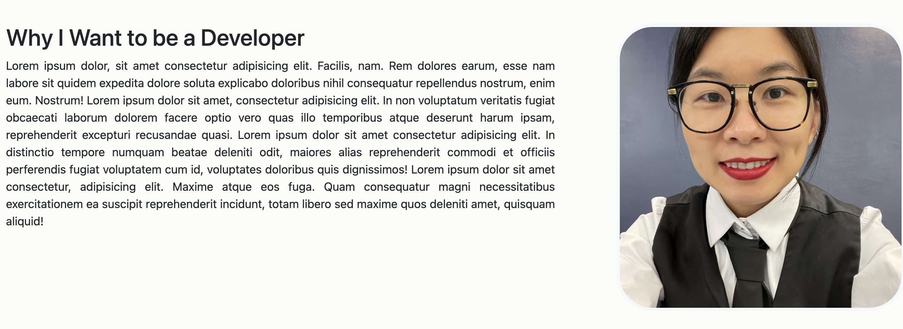
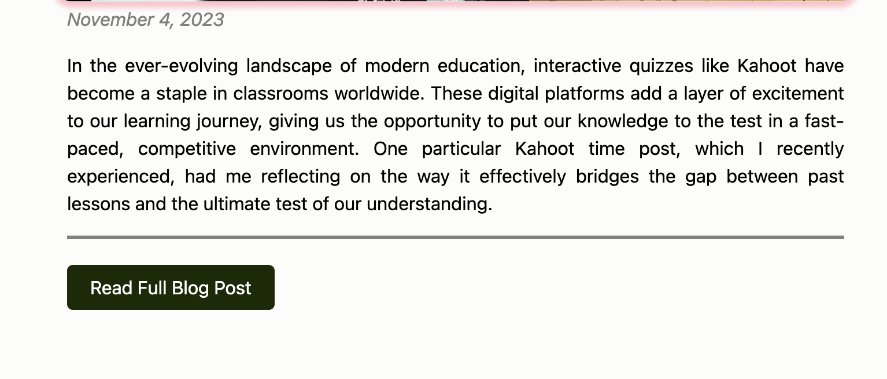
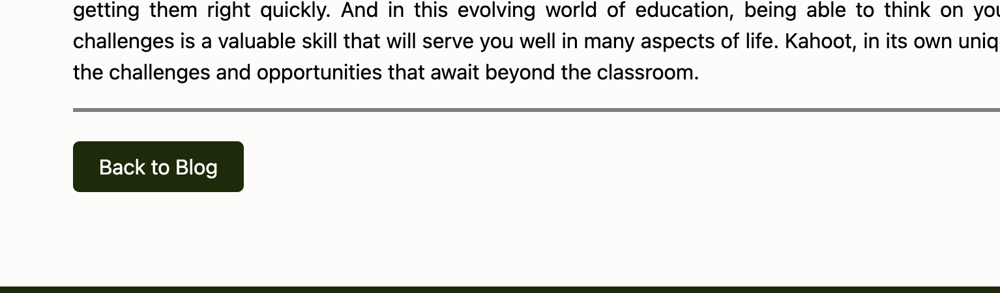

# THIS IS SHUZHEN LIU (ESTHER)'S PORTFOLIO


### Portfolio website
[link to portfolio](https://shuzhen-portfolio.netlify.app/)

### Git repo
[link to git](https://github.com/estherszliu/portfolio)

### Presentation
[link to presentation]()

## Overview
This is a portfolio wedsite to display about SHUHZNE (Esther)'s work experience, hobbies,and how she want to become developer, demonstrate her skills and also ber social life, and get in touch with her. 

The portfolio wedsite has four main page + five blog post page inside of the blog page. Which is:
* Home
* About
* Blog 
* Contact
## Sitmap 
Here is the picture for sitemap :

## Components

### Header
Header is the component at the top of the website. It contains picture, message, navigation bar and a nav-icon. 
The picture when on click will direct to the about page.
The nav-icon has a javascript function which used bootstrap library. 


Here is the code for the header:
```html
 <header class="header-root">
    <!-- Graphical Component: Profile image with welcome message -->
    <section class="profile-message">
        <a href="./pages/about.html">
            
        </a>
        <label>
            "Hi, I'm Esther!"
        </label>
    </section>
    <!-- Text Component: Responsive navigation menu -->
    <nav>
        <div id="nav-buttons-root" class="nav-buttons-root-hide">
            <a class="nav-button" href="./index.html">Home</a>
            <a class="nav-button" href="./pages/about.html">About</a>
            <a class="nav-button" href="./pages/blog.html">Blog</a>
            <a class="nav-button" href="./pages/contact.html">Contact</a>
        </div>
        <a class="nav-icon" onclick="toggleNavMenu()">
            <i class="fa fa-bars"></i>
        </a>
    </nav>
 </header>
```
Here is the nav-icon which locate in the head tag:
```html
<script>
    function toggleNavMenu() {   
        var e = document.getElementById("nav-buttons-root");
        if (e.className === "nav-buttons-root") {
            e.className = "nav-buttons-root-hide";
        } else {
            e.className = "nav-buttons-root";
        }
    }  
 </script>
```

### Footer
Footer has a text, social media links and a hypertext reference to send a mail. 

Here is the code for footer:
```html
 <footer>
    <!-- Graphical Component: Contact me through social media -->
    <section class="social-media">
        <h5>Get in touch with me today</h5>
        <div class="social-contacts-container">
            <a href="https://www.facebook.com" target="_blank">
                <i class="fa-brands fa-facebook"></i>
            </a>
            <a href="https://www.github.com" target="_blank">
                <i class="fa-brands fa-github"></i>
            </a>
            <a href="https://www.linkedin.com" target="_blank">
                <i class="fa-brands fa-linkedin"></i>
            </a>
        </div>
    </section>

    <!-- Text Component: Send mail button -->
    <section class="footer-contact">
        <a href="mailto: 15076@coderacademy.edu.au">
            Send mail
            <i class="fa-regular fa-paper-plane"></i>              
        </a>
    </section>
</footer>
```

### Home page
In the Home page main tag, has two sections, first section is introduction and a picture, second section is lozenge display what skills I got.


Here is the code for the home page:
```html
<main>
    <section>

        <!-- Graphical Component: Intro bio about me with an image -->
        <section class="bio-root">
            <div>
                <div>
                    <h1>
                        Shuzhen Liu(Esther)
                    </h1> 
                    <h4>
                        Software developer
                    </h4>
                </div>
                <div class="bio-description">
                    <p>
                        Hi! Welcome to my portfolio! 
                        <br>
                        <br>
                            I'm Esther, an aspiring software developer eager to embark on an exciting journey in the tech world. Proficient in Python, JavaScript, HTML, CSS, and Git, I'm ready to contribute my skills to many exciting projects.
                            With a strong foundation in these key technologies, I bring a problem-solving mindset and a commitment to continuous learning. I'm passionate about crafting efficient, user-friendly solutions that make a real impact. My experience in Python spans data analysis, automation, and application development, while my expertise in front-end technologies ensures a seamless user experience.
                            I believe in the power of code to transform ideas into reality, and I'm dedicated to pushing the boundaries of what's possible in software development. I approach each project with enthusiasm and a desire to excel, embracing challenges as opportunities for growth.
                            Let's collaborate to turn concepts into functional, innovative, and elegant software solutions. I'm here to help you achieve your digital goals and bring your vision to life.
                        <br>
                        <br>
                        Feel free to look around and get to know more about me and where I want to go with my career.
                    </p>
                </div>
            </div>
            <aside>
                
            </aside>  
        </section>

        <!-- Text Component: List of my skills -->
        <section class="skills-root">
            <h5>
                My Skills
            </h5>
            <div class="skills-row-container">
                <div class="skill-lozenge">HTML</div>
                <div class="skill-lozenge">CSS</div>
                <div class="skill-lozenge">Python</div>
                <div class="skill-lozenge">Git</div>
                <div class="skill-lozenge">Web Development</div>
            </div>
            <div class="skills-row-container">
                <div class="skill-lozenge">Flask</div>
                <div class="skill-lozenge">MySQL</div>
                <div class="skill-lozenge">Backend Development</div>
                <div class="skill-lozenge">OOP</div>
                <div class="skill-lozenge">SASS</div>
            </div>
        </section>
    </section>
</main>
```

### About page
The About page has three articles, the first and third one both with a picture as aside, but the second article has an aside with image grid.



Here is the code for the About page:
```html
<main>   
    <section>
        <div class="heading">
            <h1>About Me</h1>
        </div>
        <div class="about">

            <!-- Text Component: Article with Header -->
            <article>
                <h2>
                    My Previous Career
                </h2>
                <p>
                    Lorem ipsum dolor, sit amet consectetur adipisicing
                    elit. Facilis, nam. Rem dolores earum, esse nam labore
                    sit quidem expedita dolore soluta explicabo doloribus
                    nihil consequatur repellendus nostrum, enim eum.
                    Nostrum! Lorem ipsum dolor sit amet, consectetur
                    adipisicing elit. In non voluptatum veritatis fugiat
                    obcaecati laborum dolorem facere optio vero quas illo
                    temporibus atque deserunt harum ipsam, reprehenderit
                    excepturi recusandae quasi. Lorem ipsum dolor sit amet
                    consectetur adipisicing elit. In distinctio tempore
                    numquam beatae deleniti odit, maiores alias
                    reprehenderit commodi et officiis perferendis fugiat
                    voluptatem cum id, voluptates doloribus quis
                    dignissimos! Lorem ipsum dolor sit amet consectetur,
                    adipisicing elit. Maxime atque eos fuga. Quam
                    consequatur magni necessitatibus exercitationem ea
                    suscipit reprehenderit incidunt, totam libero sed maxime
                    quos deleniti amet, quisquam aliquid!
                </p>
            </article>

            <!-- side image -->
            <aside>
                
            </aside>
        </div>
        <div class="about">

            <!-- Text Component: Article with Header -->
            <article>
                <h2>
                    My Hobbies
                </h2>
                <p>
                    Lorem ipsum dolor, sit amet consectetur adipisicing
                    elit. Facilis, nam. Rem dolores earum, esse nam labore
                    sit quidem expedita dolore soluta explicabo doloribus
                    nihil consequatur repellendus nostrum, enim eum.
                    Nostrum! Lorem ipsum dolor sit amet, consectetur
                    adipisicing elit. In non voluptatum veritatis fugiat
                    obcaecati laborum dolorem facere optio vero quas illo
                    temporibus atque deserunt harum ipsam, reprehenderit
                    excepturi recusandae quasi. Lorem ipsum dolor sit amet
                    consectetur adipisicing elit. In distinctio tempore
                    numquam beatae deleniti odit, maiores alias
                    reprehenderit commodi et officiis perferendis fugiat
                    voluptatem cum id, voluptates doloribus quis
                    dignissimos! Lorem ipsum dolor sit amet consectetur,
                    adipisicing elit. Maxime atque eos fuga. Quam
                    consequatur magni necessitatibus exercitationem ea
                    suscipit reprehenderit incidunt, totam libero sed maxime
                    quos deleniti amet, quisquam aliquid!
                </p>
            </article>

                <!--Graphical Component: Side Image Grid-->
            <aside>
                <div class="image-grid-4">
                    <div class="image-grid-row">
                        
                        
                    </div>
                    <div class="image-grid-row">
                        
                        
                    </div>
                </div>
            </aside>
        </div>
        <div class="about">

            <!-- Text Component: Article with Header -->
            <article>
                <h2>
                    Why I Want to be a Developer
                </h2>
                <p>
                    Lorem ipsum dolor, sit amet consectetur adipisicing
                    elit. Facilis, nam. Rem dolores earum, esse nam labore
                    sit quidem expedita dolore soluta explicabo doloribus
                    nihil consequatur repellendus nostrum, enim eum.
                    Nostrum! Lorem ipsum dolor sit amet, consectetur
                    adipisicing elit. In non voluptatum veritatis fugiat
                    obcaecati laborum dolorem facere optio vero quas illo
                    temporibus atque deserunt harum ipsam, reprehenderit
                    excepturi recusandae quasi. Lorem ipsum dolor sit amet
                    consectetur adipisicing elit. In distinctio tempore
                    numquam beatae deleniti odit, maiores alias
                    reprehenderit commodi et officiis perferendis fugiat
                    voluptatem cum id, voluptates doloribus quis
                    dignissimos! Lorem ipsum dolor sit amet consectetur,
                    adipisicing elit. Maxime atque eos fuga. Quam
                    consequatur magni necessitatibus exercitationem ea
                    suscipit reprehenderit incidunt, totam libero sed maxime
                    quos deleniti amet, quisquam aliquid!
                </p>
            </article>

                <!-- Side image -->
            <aside>
                
            </aside>
        </div>
    </section>
</main>
```

### Blog page
The Blog page has a text to top in the middle and follow by five section, which once section is one blog. Each section contain a figure (tittl, image, time), an article and a hypertext reference to link to read the full blog post. 


Here is the code:
```html
<main>
    <div class="blog-heading">
        <h1>Welcome to my Blog!</h1>
    </div>
        
    <!-- Kahoot Blog Post -->
    <section>
        <!-- Graphical Component: Blog hero image with date and title -->
        <figure>
            <h2>Kahoot Time</h2>
            <div class="image-container">
                
            </div>
            <time>
                November 4, 2023
            </time>
        </figure>

        <!-- Text Component: Blog summary -->
        <article class="content">
            <p>
                In the ever-evolving landscape of modern education, interactive quizzes like Kahoot have 
                become a staple in classrooms worldwide. These digital platforms add a layer of excitement 
                to our learning journey, giving us the opportunity to put our knowledge to the test in a 
                fast-paced, competitive environment. One particular Kahoot time post, which I recently experienced, 
                had me reflecting on the way it effectively bridges the gap between past lessons and the ultimate 
                test of our understanding.
            </p>
        </article>

        <!-- Text Component: Blog navigation -->
        <nav>
            <a href="./blog-posts/blog-1-kahoot.html">
                Read Full Blog Post
            </a>
        </nav>
    </section>

    <!-- Desk Setup Blog Post -->
    <section>
        <!-- Graphical Component: Blog hero image with date and title -->
        <figure>
            <h2>All Set for my Study!</h2>
            <div class="image-container">
                
            </div>
            <time>
                October 15, 2023
            </time>
        </figure>

        <!-- Text Component: Blog summary -->
        <article class="content">
            <p>
                Lorem ipsum dolor, sit amet consectetur adipisicing
                elit. Facilis, nam. Rem dolores earum, esse nam labore
                sit quidem expedita dolore soluta explicabo doloribus
                nihil consequatur repellendus nostrum, enim eum.
                Nostrum! Lorem ipsum dolor sit amet, consectetur
                adipisicing elit. In non voluptatum veritatis fugiat
                obcaecati laborum dolorem facere optio vero quas illo
                temporibus atque deserunt harum ipsam, reprehenderit
                excepturi recusandae quasi. Lorem ipsum dolor sit amet
                consectetur adipisicing elit. In distinctio tempore
                numquam beatae deleniti odit, maiores alias
                reprehenderit commodi et officiis perferendis fugiat
                voluptatem cum id, voluptates doloribus quis
                dignissimos! Lorem ipsum dolor sit amet consectetur,
                adipisicing elit. Maxime atque eos fuga. Quam
                consequatur magni necessitatibus exercitationem ea
                suscipit reprehenderit incidunt, totam libero sed maxime
                quos deleniti amet, quisquam aliquid!
            </p>
        </article>

        <!-- Text Component: Blog navigation -->
        <nav>
            <a href="./blog-posts/blog-2-allset.html">
                Read Full Blog Post
            </a>
        </nav>
    </section>

    <!-- Feeding Kangaroo Blog Post -->
    <section>
        <!-- Graphical Component: Blog hero image with date and title -->
        <figure>
            <h2>Feeding Kangaroos</h2>
            <div class="image-container">
                
            </div>
            <time>
                September 5, 2023
            </time>
        </figure>

        <!-- Text Component: Blog summary -->
        <article class="content">
            <p>
                Lorem ipsum dolor, sit amet consectetur adipisicing
                elit. Facilis, nam. Rem dolores earum, esse nam labore
                sit quidem expedita dolore soluta explicabo doloribus
                nihil consequatur repellendus nostrum, enim eum.
                Nostrum! Lorem ipsum dolor sit amet, consectetur
                adipisicing elit. In non voluptatum veritatis fugiat
                obcaecati laborum dolorem facere optio vero quas illo
                temporibus atque deserunt harum ipsam, reprehenderit
                excepturi recusandae quasi. Lorem ipsum dolor sit amet
                consectetur adipisicing elit. In distinctio tempore
                numquam beatae deleniti odit, maiores alias
                reprehenderit commodi et officiis perferendis fugiat
                voluptatem cum id, voluptates doloribus quis
                dignissimos! Lorem ipsum dolor sit amet consectetur,
                adipisicing elit. Maxime atque eos fuga. Quam
                consequatur magni necessitatibus exercitationem ea
                suscipit reprehenderit incidunt, totam libero sed maxime
                quos deleniti amet, quisquam aliquid!
            </p>
        </article>

        <!-- Text Component: Blog navigation -->
        <nav>
            <a href="./blog-posts/blog-3-kangaroos.html">
                Read Full Blog Post
            </a>
        </nav>
    </section>

    <!-- An Interesting House Blog Post -->
    <section>
        <!-- Graphical Component: Blog hero image with date and title -->
        <figure>
            <h2>An Interesting House</h2>
            <div class="image-container">
                
            </div>
            <time>
                August 9, 2023
            </time>
        </figure>

        <!-- Text Component: Blog summary -->
        <article class="content">
            <p>
                Lorem ipsum dolor, sit amet consectetur adipisicing
                elit. Facilis, nam. Rem dolores earum, esse nam labore
                sit quidem expedita dolore soluta explicabo doloribus
                nihil consequatur repellendus nostrum, enim eum.
                Nostrum! Lorem ipsum dolor sit amet, consectetur
                adipisicing elit. In non voluptatum veritatis fugiat
                obcaecati laborum dolorem facere optio vero quas illo
                temporibus atque deserunt harum ipsam, reprehenderit
                excepturi recusandae quasi. Lorem ipsum dolor sit amet
                consectetur adipisicing elit. In distinctio tempore
                numquam beatae deleniti odit, maiores alias
                reprehenderit commodi et officiis perferendis fugiat
                voluptatem cum id, voluptates doloribus quis
                dignissimos! Lorem ipsum dolor sit amet consectetur,
                adipisicing elit. Maxime atque eos fuga. Quam
                consequatur magni necessitatibus exercitationem ea
                suscipit reprehenderit incidunt, totam libero sed maxime
                quos deleniti amet, quisquam aliquid!
            </p>
        </article>

        <!-- Text Component: Blog navigation -->
        <nav>
            <a href="./blog-posts/blog-4-house.html">
                Read Full Blog Post
            </a>
        </nav>
    </section>

    <!-- Best Dessert Ever Blog Post -->
    <section>
        <!-- Graphical Component: Blog hero image with date and title -->
        <figure>
            <h2>Best Dessert Ever</h2>
            <div class="image-container">
                
            </div>
            <time>
                July 3, 2023
            </time>
        </figure>

        <!-- Text Component: Blog summary -->
        <article class="content">
            <p>
                Lorem ipsum dolor, sit amet consectetur adipisicing
                elit. Facilis, nam. Rem dolores earum, esse nam labore
                sit quidem expedita dolore soluta explicabo doloribus
                nihil consequatur repellendus nostrum, enim eum.
                Nostrum! Lorem ipsum dolor sit amet, consectetur
                adipisicing elit. In non voluptatum veritatis fugiat
                obcaecati laborum dolorem facere optio vero quas illo
                temporibus atque deserunt harum ipsam, reprehenderit
                excepturi recusandae quasi. Lorem ipsum dolor sit amet
                consectetur adipisicing elit. In distinctio tempore
                numquam beatae deleniti odit, maiores alias
                reprehenderit commodi et officiis perferendis fugiat
                voluptatem cum id, voluptates doloribus quis
                dignissimos! Lorem ipsum dolor sit amet consectetur,
                adipisicing elit. Maxime atque eos fuga. Quam
                consequatur magni necessitatibus exercitationem ea
                suscipit reprehenderit incidunt, totam libero sed maxime
                quos deleniti amet, quisquam aliquid!
            </p>
        </article>

        <!-- Text Component: Blog navigation -->
        <nav>
            <a href="./blog-posts/blog-5-dessert.html">
                Read Full Blog Post
            </a>
        </nav>
    </section>
</main>
```

### The Read Full Blog Post
The Read Full Blog Post is the on the Blog page when you want to read the full Blog page, it will direct to a html which contain the single blog contents, which has the same post title, picture, time and article. On the bottom after the article, also has a button of Back to Blog which will direct back to the main blog page. 



Here is the code:
```html
<main>
    <div class="blog-heading">
        <h1>Welcome to my Blog!</h1>
    </div>
    <section>

        <!-- Graphical Component: Blog hero image with date and title -->
        <figure>
            <h2>Feeding Kangaroos</h2>
            <div class="image-container">
                
            </div>
            <time>
                September 5, 2023
            </time>
        </figure>

        <!-- Text Component: Blog content -->
        <article class="content">
            <p> 
                In the ever-evolving landscape of modern education, interactive quizzes like Kahoot have 
                become a staple in classrooms worldwide. These digital platforms add a layer of excitement 
                to our learning journey, giving us the opportunity to put our knowledge to the test in 
                a fast-paced, competitive environment. One particular Kahoot time post, which I recently 
                experienced, had me reflecting on the way it effectively bridges the gap between past 
                lessons and the ultimate test of our understanding.   
                <br>
                <br>
                As a diligent student who has spent countless hours immersed in the course material, I 
                was thrilled when I managed to secure the 7th spot in one of the most recent Kahoot 
                sessions. However, what became abundantly clear is that speed is the name of the game. 
                The highest-scoring students in Kahoot aren't just knowledgeable; they are lightning-quick 
                in their responses. In this blog post, we'll dive into my Kahoot journey, the strategies 
                I've picked up along the way, and how these fast-paced quizzes are shaping the educational 
                experience for students like me. Let's explore the fascinating world of Kahoot and uncover 
                the secrets to success in this dynamic learning environment.                 
            </p>

            <h3>The Kahoot Experience: A Journey of Learning and Competition</h3>
            <p>
                Kahoot, for those who may not be familiar, is an online learning platform that offers a 
                gamified approach to education. It's a tool that educators use to engage students in an 
                interactive way, allowing them to assess their knowledge and retention of the material 
                through quizzes and surveys. These Kahoot sessions often serve as a review of previous 
                lessons, ensuring that students remain connected to the course material and can assess 
                their grasp of the subject matter. This format is not only fun but also an excellent way 
                to reinforce learning.
            </p>
            
            <h3>The Need for Speed: A Lesson in Quick Thinking</h3>
            <p>
                My journey to the 7th spot on the Kahoot leaderboard was a rollercoaster ride of 
                emotions and challenges. The key to success in Kahoot, as I soon discovered, is 
                not just knowledge but the ability to think on your feet. Kahoot quizzes are designed 
                to reward swift and accurate answers. If you want to claim the top positions, you 
                must be quick with your responses, often with just seconds to spare.
            </p>
            <p>
                The students who consistently secure the top three spots in Kahoot sessions possess 
                a unique set of skills. They have mastered the art of reading and comprehending 
                questions at lightning speed, often even before the choices are fully revealed. 
                It's a bit like being on a game show, where every second counts, and hesitation can 
                cost you dearly.
            </p>
            
            <h3>Strategies for Kahoot Success</h3>
            <p>
                As I aimed to improve my Kahoot ranking, I started implementing a few strategies that 
                helped me keep up with the fastest responders:
            </p>
            <p>
                1. <strong>Practice, Practice, Practice</strong>: Familiarity with the Kahoot platform 
                and the types of questions asked is crucial. The more you practice, the better you 
                become at navigating the interface and understanding the question patterns.
            </p>
            <p>
                2. <strong>Stay Calm and Focused</strong>: The pressure of time can be daunting, but 
                staying calm and focused is essential. Panic can lead to hasty mistakes. Take a deep 
                breath, read the question thoroughly, and then answer.
            </p>
            <p>
                3. <strong>Preparation is Key</strong>: Reviewing the course material before the Kahoot 
                session can be a game-changer. The more you know, the easier it is to respond quickly.
            </p>
            <p>
                4. <strong>Multi-tasking Skills</strong>: Train your brain to quickly switch between the 
                question and answer choices. This can save valuable seconds.
            </p>
            <p>
                5. <strong>Use Your Lifelines Wisely</strong>: In some Kahoots, lifelines like 
                "Double Points" or "Bomb" can be game-changers. Knowing when and how to use them can give 
                you a significant advantage.
            </p>
            
            <h3>The Impact of Kahoot on Education</h3>
            <p>
                Kahoot's gamified approach to learning has revolutionized the way we engage with course 
                material. It's not just about cramming facts and figures; it's about understanding and 
                retaining knowledge in an enjoyable and memorable way. Kahoot fosters a sense of community 
                among students, as we compete and collaborate to enhance our learning experience.
            </p>
            <p>
                Moreover, the real-time feedback provided by Kahoot quizzes allows educators to identify 
                areas where students may be struggling. This invaluable information helps teachers tailor 
                their instruction to meet the specific needs of their students, ultimately leading to 
                improved learning outcomes.
            </p>
            
            <h3>Conclusion</h3>
            <p>
                Kahoot has become more than just a platform for testing our knowledge; it's a journey that 
                combines learning with the thrill of competition. As I continue to hone my skills and work 
                on my response speed, I find myself not only enjoying the experience more but also grasping 
                the course material more effectively.
            </p>
            <p>
                So, the next time you find yourself in a Kahoot session, remember that it's not just about 
                getting the answers right; it's about getting them right quickly. And in this evolving world 
                of education, being able to think on your feet and adapt to new challenges is a valuable 
                skill that will serve you well in many aspects of life. Kahoot, in its own unique way, is 
                preparing us for the challenges and opportunities that await beyond the classroom.
            </p>
        </article>

        <!-- Text Component: Blog navigation -->
        <nav>
                <a href="../blog.html">
                    Back to Blog
                </a>
        </nav>
    </section>
</main>
```

### Contact Page
The Contact page has two section, the first section has heading, image, contact details, social media links and a bottom to download CV. The seccond section has a contact form which user can input their name, email, subject, messages. 


Here is the code for the Contact Page:
```html
 <main>
    <div class="contact-heading">
        <h2>Contact Me</h2>
    </div>
    <section class="body-content">
        <section class="contact-me-container">

            <!-- Graphical Component: Image with header -->
            <figure class="image-container">
                <h4>Let's Chat</h4>
                
            </figure>

            <!-- Contact Details -->
            <section class="contact-details-container">
                <h4>My Contact Details</h4>

                <!-- Text Component: Contact Item -->
                <section class="contact-item">
                    <div class="contact-title">
                        <i class="fa-solid fa-envelope"></i>
                        <h4>Email</h4>
                    </div>
                    <p>15076@coderacademy.edu.au</p>
                </section>

                <!-- Text Component: Contact Item -->
                <section class="contact-item">
                    <div class="contact-title">
                        <i class="fa-solid fa-location-dot"></i>
                        <h4>Address</h4>
                    </div>
                    <p>Brisbane, QLD</p>
                </section>

                <!-- Graphical Component: Social Media Links -->
                <section class="social-items">
                    <a href="https://www.facebook.com" target="_blank">
                        <i class="fa-brands fa-facebook"></i>
                    </a>
                    <a href="https://www.github.com" target="_blank">
                        <i class="fa-brands fa-github"></i>
                    </a>
                    <a href="https://www.linkedin.com" target="_blank">
                        <i class="fa-brands fa-linkedin"></i>
                    </a>
                </section>

                <!-- Download CV -->
                <section class="download-tag">
                    <a href="../files/cv.docx" download="cv">Download CV</a>
                </section>
            </section>
        </section>

        <!-- Text Component: Contact Form -->
        <section class="contact-form-container">
            <section class="contact-form">
                <h4>Get in Touch Today</h4>
                <form>
                    <div class="form-input-container">
                        <label>Name:</label>
                        <input class="form-input">
                    </div>
                    <div class="form-input-container">
                        <label>Email:</label>
                        <input class="form-input">
                    </div>
                    <div class="form-input-container">
                        <label>Subject: </label>
                        <input class="form-input">
                    </div>
                    <div class="form-input-container">
                        <label>Messages:  </label>
                        <textarea
                            rows="3"
                            class="form-input"
                            id="form-textarea"
                        ></textarea>
                    </div>
                    <div class="btn-div">
                        <button id="submit">Submit</button>
                    </div>
                </form>
            </section>
        </section>
    </section>
</main>
```
